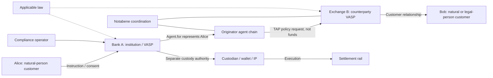

# Actor map — roles, authority and accountability

Snapshot: 2026-09-24. This map concerns **who may act for whom**, not database cardinalities. Agent roles are not automatically legal authority; `Agent.for` records representation but does not independently prove mandate, key ownership or regulatory permission. **VERIFIED** refers to documented roles; the responsibility synthesis is **INFERRED**, subject to contracts.

| Actor | Identity / role | Permitted or documented action | Does not establish / remaining authority question |
|---|---|---|---|
| Institution | Commercial integrating organization, users, OAuth client and entity DID | Onboards entity, holds backend credentials, submits transfers, governs customer records | Organization/user/entity RBAC and production permission matrix remain UNKNOWN |
| Natural person | Customer record / IVMS101 natural-person branch | Gives instruction and supplies identity / wallet evidence | Not automatically an independently resolvable DID or VASP |
| Legal person | Customer record / IVMS101 legal-person branch | Acts through authorized representatives; supplies legal-person identity | Incorporation evidence and representative mandate remain institution duties |
| VASP / CASP | Entity participating in exchange; may be originator or beneficiary institution | Represents customer, exchanges required data, evaluates requests | Directory discovery is not a regulatory authorization |
| Transfer agent | `@id`, optional `for`, role and policies | Represents another participant; requests/fulfils authorization or presentation | Role label alone is not delegation credential or custody control |
| PIA | Payment Initiation Agent | Initiates Flow context: pay-in payee side; payout payer side | Initiation does not mean funds were moved |
| PRA | Payment Receiving Agent | Responds to Flow context: pay-in payer side; payout payee side | Pay-in settlement-address deployed contract remains disputed |
| IP | Infrastructure Provider | Supplies agreed wallet/custody/liquidity/banking/execution capability | Does not acquire customer relationship merely by being an IP |
| Custodian | Institution or contracted agent controlling signing infrastructure | Executes authorized custody instruction under its own controls | Notabene authorization is not itself a blockchain signature |
| Wallet / address | Software/key controller or address identifier; may be self-hosted | Signs proof or value transaction where supported | Address is not a legal person; a declaration is not cryptographic proof |
| Counterparty institution | Remote entity receiving TAP / PII requests | Evaluates its own policies and authorizes/rejects | One party's decision does not replace the other's legal obligations |
| Notabene | Hosted network, component, coordination and optional PII operator | Routes, discovers, records state, operates managed PII where selected | Does not execute settlement or replace KYC/KYB/legal interpretation |
| Compliance operator | Institution personnel | Reviews screenshot evidence, investigates flags, decides exceptions | Micro-transfer on-chain confirmation ownership remains UNKNOWN |
| Regulator / legal authority | External source of obligations | Establishes applicable legal duties | Not a normal TAP message participant or runtime API permission |

## Worked Bank A → Alice → Exchange B → Bob walk

1. **VERIFIED documented contract:** Bank A keeps its institution client secret and 24-hour access token server-side. The V1 customer-token pattern gives Alice's browser a five-minute customer-scoped token. Do not transplant this TTL into the V2 delegate JWT.
2. **VERIFIED schema:** Alice and Bob may be entity-owned customer records. Bank A and Exchange B are distinct entity identities; a customer identifier is not evidence of a publicly resolvable customer DIDDoc.
3. **VERIFIED format / INFERRED composition:** Bank A forms SourceAddress → originator VASP → Alice and SettlementAddress → beneficiary VASP → Bob representation chains through `for`. Actual mandate checks are not proven by this field.
4. **VERIFIED capability / UNKNOWN deployment:** DID resolution supplies candidate keys; the library supports signed and encrypted profiles. The live P-256 key is `JsonWebKey2020` / `#notabene-pii`, unlike the documentation example. Production key selection and DIDComm profile must be confirmed.
5. **VERIFIED documented modes:** managed PII puts Notabene inside the plaintext boundary; optional customer-managed E2E forwards nested ciphertext. This is a per-mode decision.
6. **INFERRED integration responsibility:** Exchange B evaluates policy; Bank A separately gates custody execution. The executor supplies settlement evidence to coordination. Neither Bob's customer record nor a TAP authorization moves money.

## Sources and evidence limits

- [Transfer payload and Agent.for](https://devx.notabene.id/docs/transfer-payload-structure.md)
- [Flow roles and schemas](https://node-open-api-specs.s3.eu-central-1.amazonaws.com/openapi.json)
- [Customer token](https://devx.notabene.id/docs/customertoken.md), [delegate token](https://devx.notabene.id/reference/createdelegatetoken.md)
- [Customer ownership](https://devx.notabene.id/reference/getflowcustomer.md)
- [Self-hosted verification](https://devx.notabene.id/docs/self-hosted-wallet-verification-1.md)
- [Live DIDDoc](https://vasps.id/no/did.json), [PII forwarding](https://devx.notabene.id/docs/self-encryption.md)

**UNKNOWN:** mandate and spending limits, revocation propagation, legal liability, regulator-specific recognition of proofs, customer identity recovery, production delegation claims and browser-token placement.