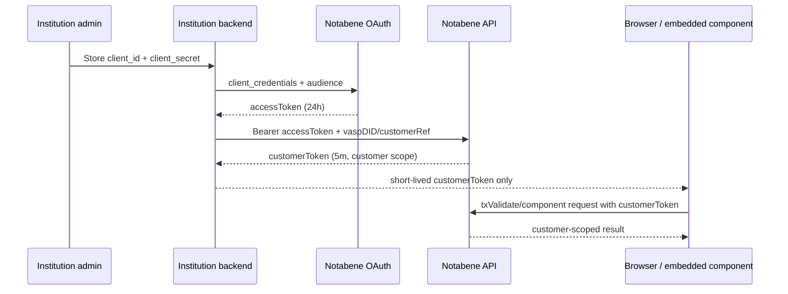

# Authentication and token chain

Evidence date: 2026-09-24.

## Credential classes

| Credential | Issued/created by | Scope/use | Public TTL evidence | Placement |
|---|---|---|---|---|
| `client_id` + `client_secret` | Notabene UI/account provisioning | OAuth client credentials for institution API access | secret lifetime/rotation UNKNOWN | backend secret store only |
| institution `accessToken` | `auth.notabene.id/oauth/token`, `client_credentials`, audience API | bearer access to Notabene APIs; entity authorization is additionally expressed by entity DID paths/permissions | **24h / 86,400s** in auth reference | backend only |
| V1 `customerToken` | backend calls customer-token endpoint using accessToken, `vaspDID`, `customerRef` | `scope: customer`; frontend `txValidate` without exposing institution accessToken | **5 minutes** | frontend, narrowly/briefly |
| V2 delegate token | entity-scoped endpoint; bearer-authenticated | JWT allows delegate to act for entity; body binds `entityDID` and `delegateId`, returns `delegateDid` | UNKNOWN | delegate/service; frontend suitability undocumented |
| DIDComm message credential | controller's DID signing/key-agreement material | authenticates/encrypts inter-agent messages | key lifetime/rotation UNKNOWN | Node/agent key store |
| webhook signing secret | Svix endpoint configuration in portal | verifies webhook origin/signature | rotation/overlap UNKNOWN | webhook receiver backend only |

## Full institution → backend → frontend chain



**NEVER send to frontend:** `client_secret`, institution `accessToken`, DIDComm/PII private keys, or webhook signing secret. This is directly supported for the accessToken/customerToken distinction and is the necessary security boundary for the remaining secrets. [identity-03, identity-04, identity-14]

## Backend flow

```json
{
  "client_id": "<server-held>",
  "client_secret": "<server-held>",
  "grant_type": "client_credentials",
  "audience": "https://api.notabene.id"
}
```

- **VERIFIED:** production and test audiences differ; response is bearer token with 86,400-second lifetime. [identity-03]
- **VERIFIED:** bearer JWT protects current entity/delegate and Flow customer endpoints. [identity-15, identity-16]
- **INFERRED:** an integration should cache the institution token server-side until shortly before expiry and mint customer tokens on demand. Refresh-token support is not documented.
- **UNKNOWN:** current V2 role/scope claim vocabulary, multi-entity claim binding, token revocation latency, rate limits for minting, and whether the V1 customerToken is accepted by every current SafeConnect V2 component.

## Customer and entity scopes

- **VERIFIED:** V1 customerToken request binds a VASP DID plus an institution-selected unique `customerRef`; response declares `scope: customer`; docs say it is specifically for frontend `txValidate`. [identity-04]
- **VERIFIED:** V2 delegate endpoint is nested under `/entities/{entityDID}` and requires body `entityDID` to match; it returns a reusable/generated delegate DID and JWT acting for that entity. [identity-15]
- **UNKNOWN:** delegate JWT TTL and precise endpoint permissions are absent from the published endpoint schema. Do not equate it to the 5-minute V1 customerToken.
- **VERIFIED:** Flow customer reads are entity + customer scoped in the URL and permission-gated for plaintext `includePII`. [identity-16]

## DID and webhook authentication

- **VERIFIED:** DIDComm authenticates messages by signing/key agreement against resolved DID documents; the receiver validates sender DID document/signature. [identity-01, identity-17]
- **VERIFIED:** webhook delivery is through Svix. The institution obtains an endpoint-specific signing secret in the portal and should verify signatures according to Svix; retries/replay are operationally supported. [identity-14]
- **UNKNOWN:** the archived Notabene page delegates exact canonicalization, headers, replay window, and algorithm to Svix documentation instead of restating them. Implement against the Svix library/spec version configured in the account, not a guessed HMAC routine.

## Worked token trace

Bank A's server stores the institution client secret, mints a 24-hour accessToken, and uses it for the Alice transfer and any server-side PII/policy calls. If a documented V1 validation component is used, Bank A's server mints a five-minute Alice customerToken and returns only that token to Alice's browser. Exchange B follows the same pattern for Bob. Webhook handlers run server-side and verify the Svix signature before acting. The blockchain wallet signer remains separate from all these Notabene tokens.

## Sources

identity-03, identity-04, identity-14, identity-15, identity-16, identity-17.

## v2 delegate-token evidence refinement

**VERIFIED source capability:** the SafeConnect V2 response transformer accepts delegateToken. This narrows which credential participates in that code path, but does not settle hosted-runtime token requirements. **UNKNOWN:** delegate JWT TTL, claims, endpoint scopes, audience, CORS, revocation and browser-safe placement. The five-minute V1 customerToken TTL must not be applied to V2.

Sources: [JavaScript SDK](https://gitlab.com/notabene/open-source/javascript-sdk), [delegate issuance](https://devx.notabene.id/reference/createdelegatetoken.md).
