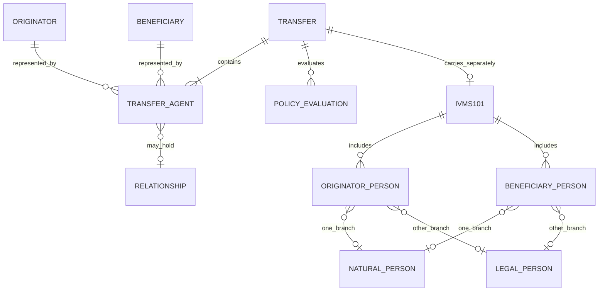

# Transact API data model

**Scope date:** 2026-09-24  
**Evidence status:** Every factual statement below is marked **VERIFIED**, **INFERRED**, or **UNKNOWN**.

## Extraction audit

- **VERIFIED** — `data/endpoints.json` was script-extracted from the public V2 OpenAPI 3.1 document and the public V1 OpenAPI 3.0 document. The inventory contains **157 operations: all 105 V2 operations (82 current, 23 explicitly deprecated) and 52 scoped V1 operations (51 documented, one deprecated)**. V2 includes Transact, Flow, customer, delegate-token, network, relationship, discovery, public-key, audit, and supporting operations. V1 includes transaction and documented supporting Trust Framework, customer, address, rule, jurisdiction, and settings operations.
- **VERIFIED** — `data/fields.json` was script-extracted by recursively following schema references and preserving `anyOf`/`oneOf`/`allOf` branch context. It contains **3,905 field-path records**: 1,157 V2 and 2,748 V1. The V2 total includes **534 fields from 42 Flow/delegate request or successful-response schema surfaces across 31 operations**. Repetition is intentional where a referenced schema appears beneath distinct root/path contexts.
- **VERIFIED** — Raw sources are retained as `research/sources/api-09-v2-openapi.json` (1,161,415 bytes at retrieval) and `research/sources/api-10-v1-openapi.json` (381,733 bytes after extraction from the public Redoc page).
- **VERIFIED** — The V2 raw specification has **85 path items, 105 HTTP operations, and 52 component schemas** overall. All 105 V2 operations are represented in `data/endpoints.json`; each entry preserves request and response schema summaries.

## V2 core transfer

The create operation is `POST /entities/{entityDID}/tx`.

| Field | OpenAPI type | Requirement | Meaning |
|---|---|---|---|
| `originator.@id` | string, 3–255 | **Required** | Originator customer identifier |
| `beneficiary.@id` | string, 3–255 | **Required** | Beneficiary customer identifier |
| `asset` | string | **Required** | Symbol or CAIP-19-like identifier accepted by the documented pattern |
| `amount` | decimal string matching `^\d+(\.\d+)?$` | **Required** | Asset quantity in decimal notation |
| `agents` | array, minimum 1 | **Required** | Agent chain |
| `ref` | string, 1–255, restricted characters | **Required** | Client reference/idempotency identifier |
| `settlementId` | string | Optional | Blockchain transaction identifier; CAIP-220 is documented and raw hashes may be normalized when asset context exists |
| `transactionValue.amount` | decimal string | Conditional on `transactionValue` object | Custom/fiat value |
| `transactionValue.currency` | string, 1–3 | Conditional on `transactionValue` object | Value currency |
| `memoTag` | printable string, 1–28 | Optional | Destination/memo tag |

**VERIFIED** — Unlike V1 `transactionAmount`, V2 `amount` is an asset-unit decimal string. V1 `transactionAmount` is a positive integer string in the asset's base unit (for example satoshi or wei). This is a material integration difference.

**VERIFIED** — V2 `Agent` requires only `@id`. Documented roles are `VASP`, `Custodian`, `SettlementAddress`, `SourceAddress`, `Gateway`, and `Unknown`; `for` expresses who the agent acts for. `policies`, `memoTag`, `selectedAsset`, and `selectedSettlementAddress` are optional in the component schema.

**VERIFIED** — The guide calls the role primarily descriptive, while the OpenAPI uses a closed role enum. Consumers should validate against the OpenAPI enum rather than invent role values.

## Identity and party graph

**VERIFIED** — Agent chains are represented through `Agent.for`; the guide's typical chain is SourceAddress → originator VASP → originator and SettlementAddress → beneficiary VASP → beneficiary. A custodian can add another delegated relationship.

## V2 IVMS101 PII

**VERIFIED** — V2 uses singular array names `originatorPerson` and `beneficiaryPerson`; V1 uses `originatorPersons` and `beneficiaryPersons`. This difference is visible in the respective OpenAPI schemas.

**VERIFIED** — Each V2 person item may contain a `naturalPerson` branch or a `legalPerson` branch plus `accountNumber`. The schema exposes:

- Natural person: structured legal/local/phonetic names; geographic address fields; national identifier, type, issuing country, and registration authority; customer identification; date and place of birth; country of residence.
- Legal person: structured legal/local/phonetic names; geographic address; customer identification; national identifier fields; country of registration.
- Originator and beneficiary containers: person arrays, container-level account numbers, and `@id`.

**VERIFIED** — In the OpenAPI schema, structural `required` arrays do **not** represent the complete jurisdiction rule. Public presentation definitions select required paths based on jurisdiction and value threshold and may encode alternatives (for example, address **OR** date/place of birth). Therefore `OPTIONAL_OR_CONDITIONAL` in `data/fields.json` means “not structurally required here,” not “never required.”

**UNKNOWN** — Website, email, and phone are requested in the user brief but do not appear in the discovered V2 `IVMS101Input` or V1 IVMS101 component schemas. Their absence from these scoped public schemas does not prove the platform never collects them elsewhere.

**VERIFIED** — LEI is represented through `nationalIdentification.nationalIdentifier` with identifier type `LEIX` in V1's enum; it is not a top-level `lei` property in the extracted IVMS schema.

## PII storage and forwarding contexts

- **VERIFIED** — `POST /entities/{entityDID}/tx/{transferId}/append` requires `ivms101`; it validates against the transfer presentation definition and encrypts before storage. Optional originator and beneficiary references jointly enable reuse of PII created by the entity. Received PII is not reused.
- **VERIFIED** — `POST /entities/{entityDID}/transfers/{transferId}/policies/{policyId}/presentation` sends PII to counterparties and supports `skipValidation`.
- **VERIFIED** — With customer-managed end-to-end encryption, documentation says the encrypted presentation is forwarded and not stored on the entity or Notabene platform. The request webhook may include the beneficiary X25519 public key.
- **VERIFIED** — With Notabene-managed encryption, documentation says Notabene encrypts using entity keys, stores locally, and re-encrypts for authorized/requesting counterparties.
- **UNKNOWN** — Public evidence reviewed here does not establish all production key-custody, retention, backup, deletion, or operator-access controls.

## Decision and settlement objects

- **VERIFIED** — Authorize accepts optional `settlementAddress` and `memoTag`; query flags `force` and `ignoreFlags` are described in the API.
- **VERIFIED** — Reject requires `reason`; `comment` becomes conditionally required when reason is `OTHER`.
- **VERIFIED** — Settle accepts optional `settlementId`, `settlementIdIndex`, and `revertSettlementId`; examples show normal settlement and revert settlement branches.
- **VERIFIED** — Transfer response fields include status, initiator, agents, asset, amount, timestamps, originator, beneficiary, settlement address/id, reference, amount/value records, flags, authorization indicators, transaction type, logs, and policy evaluations. Many are nullable/optional.

## V1 versus V2 shape

| Concern | SafeTransact V1 | Transact V2 |
|---|---|---|
| Create | `POST /tx/create` | `POST /entities/{entityDID}/tx` |
| Amount | Base-unit positive integer string | Decimal asset-unit string |
| Parties | IVMS data can be in create/update payload | Create uses party IDs; PII appended/presented separately |
| VASP routing | `originatorVASPdid`, `beneficiaryVASPdid` | Agent chain with `@id`, `for`, and role |
| Blockchain data | `transactionBlockchainInfo.txHash/origin/destination` | Source/settlement address agents plus `settlementId` |
| State vocabulary | `SAVED`, `NEW`, `SENT`, `ACK`, etc. | Per-entity transfer, agent, relationship, and TAP-policy status families |
| PII fields | `ivms101`, `ivms101Encrypted`, `pii` appear in response schema | IVMS append/presentation operations with managed or customer encryption |

## Source-schema caveats

- **VERIFIED conflict** — Current V2 OpenAPI paths use plural `/entities`. Several guides and callback examples use singular `/entity`, including the managed-encryption guide and authorization callback example. The OpenAPI also retains plural `/entities/{entityDID}/transfers...` deprecated aliases and a non-deprecated PII presentation path under `/transfers`. Integration code should use the exact current OpenAPI operation path and treat guide callback URLs as server-provided opaque URLs.
- **VERIFIED conflict** — The status guide omits `AWAITING-YOURS` and `AWAITING-COUNTERPARTY`, although both are present in the V2 `TransferStatus` enum. No transition edges for these two values were found in the status table; they remain enumerated but transition-undocumented.
- **INFERRED** — The V2 model separates public transfer coordination from PII storage/presentation more explicitly than V1. This follows from endpoint and schema separation, but internal service boundaries are not public.

## v2 audit corrections and exact source contracts

**VERIFIED:** both generations serialize amounts as strings. V1 base-unit quantities must not be converted through JavaScript `Number`; V2 Transact decimal asset-unit strings have `^\d+(\.\d+)?$`. Flow payout `amount` is a string **without that decimal pattern**. Entity payout create requires exactly `ref`, `currency`, `amount`, `customer`, `merchant`; duplicate `ref` has a documented 409 response with `existingRef`. Entity pay-in create additionally requires `supportedAssets` and `fallbackSettlementAddresses`. Do not infer validators shared across these operations.

**VERIFIED:** V1 `nameIdentifierType` becomes V2 `naturalPersonNameIdentifierType`, alongside plural-to-singular person-array property renames; singular property names do not mean scalar cardinality.

**VERIFIED conflict:** Agent policy enum values are uppercase `REQUIRE_*`, but the inline `RequireAuthorization` example does not satisfy that enum. Runtime acceptance remains **UNKNOWN**.

Sources: [V1 OpenAPI via Redoc](https://doc.notabene.id/), [V2 OpenAPI](https://node-open-api-specs.s3.eu-central-1.amazonaws.com/openapi.json), [embedded component transformations](https://devx.notabene.id/docs/embedded-components-v2-api.md), [transfer payload](https://devx.notabene.id/docs/transfer-payload-structure.md), [managed PII](https://devx.notabene.id/docs/encryption-by-notabene.md), [self encryption](https://devx.notabene.id/docs/self-encryption.md).

**VERIFIED SDK != OPENAPI:** Relationships POST proof branches contain twelve cryptographic signature types (eip-191, eip-712, eip-1271, bip-137, bip-322, tip-191, ed25519, xrp-ed25519, xlm-ed25519, cip-8, siwe, siwx), plus screenshot, self-declaration and microtransfer: fifteen type values, not twelve total proof methods. Optional xpub is still present in all four OpenAPI branches despite removal from JavaScript SDK proof types. API acceptance is not determined by that source removal. [V2 OpenAPI](https://node-open-api-specs.s3.eu-central-1.amazonaws.com/openapi.json), [SDK commit](https://gitlab.com/notabene/open-source/javascript-sdk/-/commit/e32555ea9ffe42274db4d8badf8696fc38b38413).
