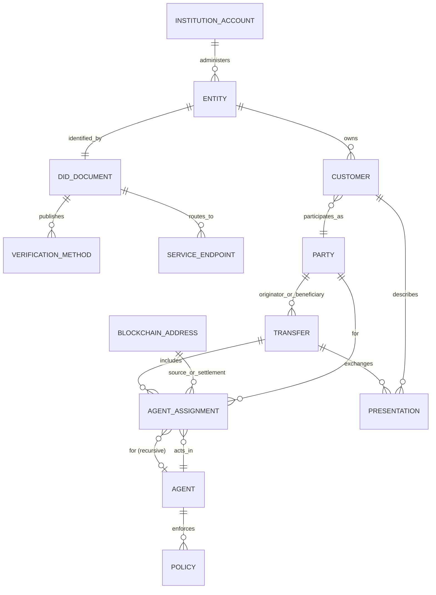

# Identity and entity model

Evidence date: 2026-09-24. Labels mean **VERIFIED** (direct public evidence), **INFERRED** (reasoned from evidence), and **UNKNOWN** (not established publicly).

## Core distinctions

- **VERIFIED — Party/person:** a transfer has an `originator` and `beneficiary`; each is the asset-sending or asset-receiving party. TAP permits person or organization participants. Notabene's Flow customer schema distinguishes `natural_person` and `legal_person`. [identity-08, identity-09, identity-16]
- **VERIFIED — Customer:** a customer is owned by an entity in Flow (`entityDid`), identified by `customerDid`, typed natural/legal, and has IVMS101 `profileData`. The API also accepts `mailto:`, `tel:`, or a supported DID method as the customer identifier. This is not evidence that every Transact customer is a DID subject. [identity-16]
- **VERIFIED — Entity/VASP:** an onboarded institution is assigned a Web DID. Its DID document represents the cryptographic and routing identity of that entity. A single domain may expose multiple entity DIDs through path segments. [identity-01]
- **VERIFIED — Agent:** operational software/institution/wallet acting `for` a party or another agent. In the current Notabene transfer guide, `@id` is a DID or wallet address, `for` encodes delegation, and role is optional/descriptive. [identity-08]
- **VERIFIED — Address relationship:** `did:pkh` can identify a source or settlement address; agent chains connect an address to a VASP/custodian and then a party. [identity-08, identity-17]
- **UNKNOWN — universal person identity:** public evidence does not establish a globally resolvable DID document, signing key, or independent credential wallet for every Alice/Bob customer. Customer references, IRIs, mail/tel identifiers, and Flow customer DIDs coexist.

## ER diagram



`AGENT_ASSIGNMENT` is a clean-room conceptual join for the payload's `agents[]`; it is not a documented Notabene table.

## Identifiers, control and lifecycle

| Concept | Identifier | Creator / controller | Persistence / lifecycle | Status |
|---|---|---|---|---|
| Institution account | organization/account identity; exact schema undocumented | customer institution; Notabene provisions client credentials | credential lifecycle undocumented | UNKNOWN |
| Entity/VASP | `did:web:{domain}:{path}` | created through onboarding; institution publishes/controls its domain, while Notabene may host/redirect | entity onboarding through removal/update; details incomplete | VERIFIED |
| DID document | Web DID resolution URL | generated initially by Notabene Node; downloaded and published by entity, or redirected to Notabene hosting | edits may take up to 5 minutes to synchronize | VERIFIED |
| Customer | customer reference/IRI or Flow `customerDid` | institution/entity | Flow includes create/update/delete and verification timestamps | VERIFIED |
| Natural/legal person | IVMS101 person inside profile/presentation | institution supplies customer data | requirements depend on policy/jurisdiction | VERIFIED |
| Agent | DID, IRI, or address DID according to context | party/controller or platform implementation | TAP supports add/replace/remove; current transfer guide allows partial discovery | VERIFIED |
| Blockchain address | commonly `did:pkh`/CAIP account | wallet/controller; ownership relation may be confirmed | relation can be confirmed/reconciled | VERIFIED |
| Transfer | UUID plus customer `ref` idempotency key | initiating entity | proposed/authorized/rejected/settled etc. | VERIFIED |

## Worked fictitious example: Bank A → Alice → Exchange B → Bob

The following is illustrative, not a captured production payload.

```json
{
  "originator": {"@id": "customer:bank-a:alice-1042"},
  "beneficiary": {"@id": "customer:exchange-b:bob-7781"},
  "asset": "eip155:1/slip44:60",
  "amount": "1.0",
  "agents": [
    {"@id": "did:pkh:eip155:1:0xSourceExample", "for": "did:web:bank-a.example:uk", "role": "SourceAddress"},
    {"@id": "did:web:bank-a.example:uk", "for": "customer:bank-a:alice-1042", "role": "VASP"},
    {"@id": "did:web:exchange-b.example:sg", "for": "customer:exchange-b:bob-7781", "role": "VASP"},
    {"@id": "did:pkh:eip155:1:0xDestinationExample", "for": "did:web:exchange-b.example:sg", "role": "SettlementAddress"}
  ],
  "ref": "bank-a-withdrawal-20260924-0001"
}
```

1. **VERIFIED pattern:** Bank A is the originator agent acting for Alice; Exchange B is the beneficiary agent acting for Bob. Addresses are agents acting for their respective institutions. [identity-08]
2. **VERIFIED pattern:** Bank A resolves Exchange B's Web DID to a DID document and DIDComm endpoint; agents exchange a Transfer, policies/presentations, and authorization messages before Bank A's wallet/custodian executes settlement. [identity-01, identity-12]
3. **INFERRED example detail:** the fictional customer IRIs above are institution-local, because public docs do not require independent Web DIDs for Alice and Bob.
4. **VERIFIED boundary:** TAP/Notabene messaging coordinates and records authorization; the on-chain transaction is executed by the originating institution's wallet/custody path, not by the TAP message itself. [identity-09, identity-12]

## Sources

See `research/identity-sources.json`; principal IDs: identity-01, identity-08, identity-09, identity-11, identity-16, identity-17.