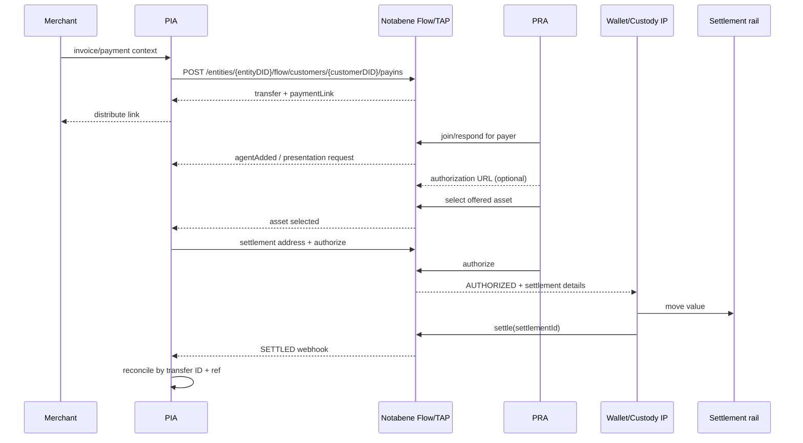
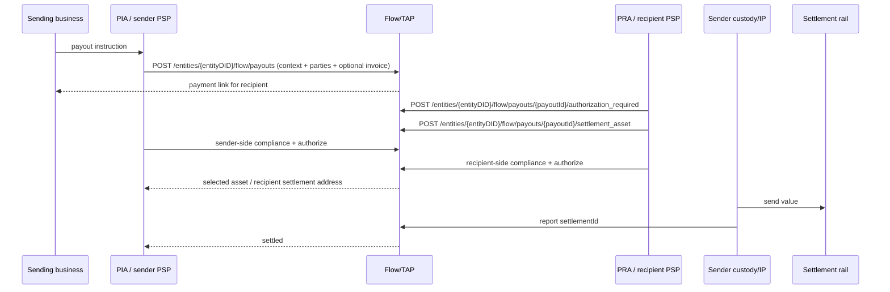
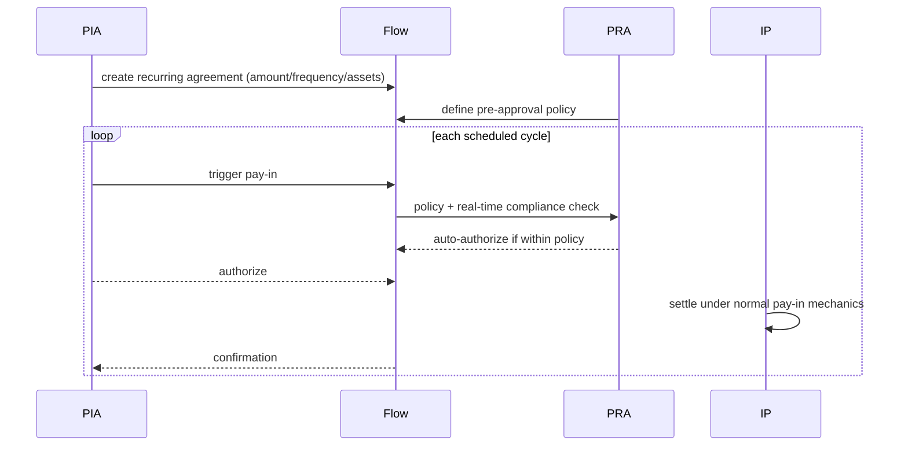

# Flow architecture and sequences

## Responsibility boundary

| Responsibility | PIA | PRA | Optional IP | Notabene Flow |
|---|---|---|---|---|
| Merchant/payee relationship in pay-in | Owns | — | No | Does not own |
| Payer relationship in pay-in | — | Owns | No | Does not own |
| KYC/KYB and institutional policy | Own checks | Own checks | Only as separately contracted | Does not replace |
| Custody / funds | May use own or IP | May use own or IP | Holds/operates only under client arrangement | Never holds |
| Payment context and routing | Supplies | Responds | Receives relevant instructions | Coordinates |
| Travel Rule data | Supplies/reviews | Supplies/reviews | As relevant to agent role | Requests/routes under policy |
| Blockchain/fiat execution | Receives pay-in; sends payout | Sends pay-in; receives payout | May execute for either side | Does not execute |
| Settlement evidence | Reconciles | Reports pay-in unless IP | Calls `/settle` when executing | Records/notifies |

All rows **VERIFIED** from [flow-S02–flow-S06] except an IP's exact custody contract, which is **UNKNOWN** and customer/provider-specific.

## Pay-in (pull / invoice)

**VERIFIED:** endpoints/events and role allocation [flow-S03–flow-S05].  
**INFERRED:** the sequence places presentation exchange compactly; exact ordering can vary by policy and relationship requirements.

### Documented pay-in payload/events

| Stage | API or event | Useful fields |
|---|---|---|
| Customer registration | `POST /entities/{entityDID}/flow/customers` | customer DID/type, IVMS101 profile, verification status/level |
| Create | `POST /entities/{entityDID}/flow/customers/{merchantCustomerDID}/payins` | `ref`, `amount`, `currency`, `asset`, `supportedAssets`, `customer`, `memo` |
| Created/opened | `flow.payin.created`, `flow.payin.opened` | transfer ID, DIDs, amount/currency/assets, payment link |
| Customer authorization | `POST .../authorization_required` | authorization URL is described but omitted from the shown response body |
| Asset selection | `POST .../settlement_address` | PRA sends only `asset`; PIA's receiving address follows |
| Compliance/policy | `tap.requirePresentationRequested`, `tap.requireAuthorizationRequested` | presentation-definition and callback URLs |
| Institutional decision | `POST /entities/{entityDID}/tx/{id}/authorize` or `/reject` | rejection may include reason/comment |
| Completion | `POST /entities/{entityDID}/tx/{id}/settle` | CAIP-like chain transaction ID or bank reference |

All rows **VERIFIED** from [flow-S03, flow-S04].

> **VERIFIED conflict:** the dated PRA quickstart instructs the PRA to send only `asset` to the pay-in `/settlement_address` endpoint, while the undated public OpenAPI requires `settlementAddress` and makes `asset` optional. The evidence does not establish which contract was deployed on 2026-09-24. [flow-S04, flow-S24]

## Payout (push)

- **VERIFIED:** payout is push; PIA represents payer, PRA represents payee. The V2 spec defines entity/customer create, list/get, incoming/outgoing views, settlement-asset selection and authorization-required operations. Narrative says sender PIA executes and receiver PRA provides receiving context. [flow-S02, flow-S06, flow-S24]
- **VERIFIED:** entity create requires `ref`, `currency`, string `amount` (no decimal pattern), `customer` and `merchant`. Customer create carries `customerDID` in the path and requires `ref`, `currency`, `amount` and `merchant`. Optional fields are CAIP-19 `supportedAssets`, `memo`, and structured invoice data. Duplicate references can return HTTP 409 with `existingRef`. [flow-S24]
- **VERIFIED:** settlement-asset selection requires CAIP-19 `asset`; `settlementAddress` is optional and accepts CAIP-10 or `payto://`. Web authorization requires `authorizationUrl`; `expires` is optional with a one-hour server default. [flow-S24]
- **VERIFIED:** reads expose `@type: Payout`, reference, asset/amount, generic transfer `status`, originator/beneficiary, supported assets, `flowState`, invoice, payment link, customer/merchant DIDs, `requiresCustomerApproval`, and timestamps. Detail also exposes agents, amount breakdown, activity log and policy evaluations. Incoming/outgoing lists clarify responder/initiator direction. [flow-S24]
- **VERIFIED / UNKNOWN:** `flow.payout.created` is named in the PRA guide. The OpenAPI describes an `AuthorizationRequired` signal but does not enumerate its emitted webhook name, and no complete payout event catalog or `flowState` enum was found. [flow-S04, flow-S24]
- **INFERRED:** sender-side value execution and final `/settle` follow the narrative and common transfer model; the spec's payout-specific endpoints do not themselves identify which sender agent must call `/settle` when an IP is present. [flow-S05, flow-S06, flow-S24]

### Documented payout API

| Stage | API | Verified request/response detail |
|---|---|---|
| Entity create | `POST /entities/{entityDID}/flow/payouts` | Requires ref/currency/amount/customer/merchant; optional assets, memo, invoice; returns transfer, state and payment link |
| Customer create | `POST /entities/{entityDID}/flow/customers/{customerDID}/payouts` | Same shape except customer comes from path |
| Discovery | `GET .../flow/payouts`, `/incoming`, `/outgoing` | Filters by refs and workflow-state string; paginated |
| Detail | `GET .../flow/payouts/{payoutId}` | Includes agents, amounts, log and policy evaluations |
| Web approval | `POST .../{payoutId}/authorization_required` | Required URI; optional expiry, default one hour |
| Asset/address | `POST .../{payoutId}/settlement_asset` | Required CAIP-19 asset; optional CAIP-10 or PayTo settlement address |

All rows **VERIFIED** from [flow-S24].

### Payout status model

- **VERIFIED:** payout objects reference the shared `TransferStatus` enum: `OUTGOING`, `INCOMING`, `AWAITING-YOURS`, `AWAITING-COUNTERPARTY`, `REJECTED`, `AUTHORIZED`, `FLAGGED`, `SETTLED`, `FLAGGED-SETTLEMENT`, `REVERTED`, `REVERT-AUTHORIZED`, `REVERT-REJECTED`, `REVERT-FLAGGED`, `REVERT-REQUESTED`, `FROZEN`, `CLEARED`. [flow-S24]
- **UNKNOWN:** `flowState` is typed only as a string in this spec, so its complete payout workflow-state vocabulary and transition graph remain unverified.

## Recurring payment

- **VERIFIED as narrative:** agreement, payer-side auto-approval policy and a new pay-in per cycle are documented. [flow-S06]
- **UNKNOWN:** no recurring endpoint, mandate object, retry/cancellation or revocation schema was located in the public API index. The sequence is not an implementable API contract.

## Agentic payments

- **VERIFIED only as announcement:** July 2026 release says Flow extends into “agentic stablecoin transactions.” [flow-S13]
- **UNKNOWN:** no endpoint, payload, delegated-authority object, spending mandate, signer, consent, policy, webhook or settlement semantics were found. Agentic payment should not be presented as a publicly documented production integration.

## Known unknowns

1. Complete payout webhook catalog and enumerated payout `flowState` transitions; create/authorization payloads and generic transfer statuses are now verified.
2. Whether all Flow PII supports customer-managed E2E mode and which party can decrypt each field.
3. Idempotency and duplicate/replay handling for payment links and `/settle`.
4. Confirmation depth, reorg, failed fiat settlement and reversal behavior.
5. Fee collection/netting mechanics.
6. IP selection/discovery and liability allocation.
7. Production status and mechanics of RLUSD, Ripple Payments and agentic support.

## v2 contract boundary additions

**VERIFIED:** payout amount is string-typed without the Transact decimal regex. Entity pay-in creation additionally requires supportedAssets and fallbackSettlementAddresses; do not infer symmetric validators from payout. Payout authorization_required requires authorizationUrl; expires is optional with a documented one-hour default. Five Flow Internal operations (signal, agent, status, authorization, fund) appear in OpenAPI; customer access/deployment is **UNKNOWN**.

Six quickstart-only event names sit outside the twelve main-guide events: flow.payin.opened, flow.payin.created, flow.payout.created, flow.payin.authorizationRequired, flow.payin.agentAdded and flow.payin.settlementAddressSelected. Names are **VERIFIED documentation**, not complete schemas or observed delivery. The data/webhooks.json inventory distinguishes both classes.

Sources: [OpenAPI](https://node-open-api-specs.s3.eu-central-1.amazonaws.com/openapi.json), [PIA](https://devx.notabene.id/docs/quickstart-pia-create-pay-ins.md), [PRA](https://devx.notabene.id/docs/quickstart-pra-respond-to-pay-ins.md), [IP](https://devx.notabene.id/docs/infrastructure-provider-ip.md).
