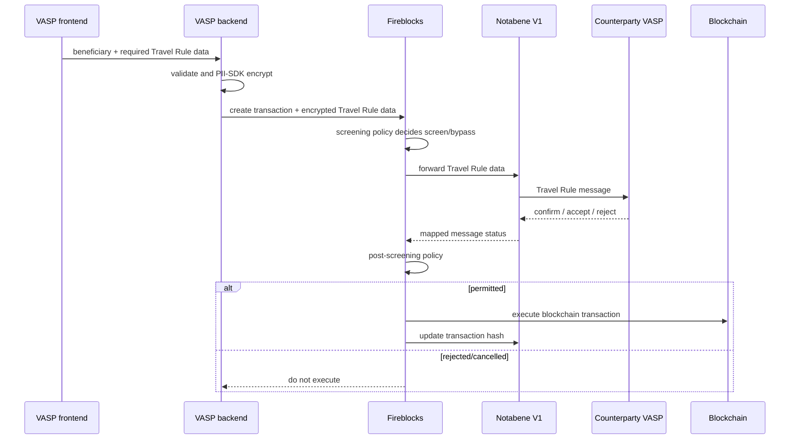
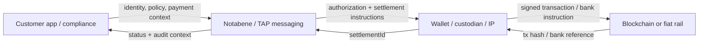

# Integration boundaries

## Responsibility table

| Integration | Status | Notabene responsibility | Partner responsibility | Customer responsibility | Data passed / boundary | Sources |
|---|---|---|---|---|---|---|
| Fireblocks (V1) | VERIFIED | Create/track Travel Rule message; expose status/rules; receive encrypted Travel Rule data; provide completion state. | Forward Travel Rule data; hold Fireblocks transaction pending; webhook on configured Notabene status; update message with blockchain hash; confirm deposit address and detect unmatched deposits. | Collect/validate front-end data; encrypt PII with PII SDK; append required encrypted fields; configure screening/post-screening; collect missing deposit data where required. | Encrypted PII and transaction context move Fireblocks→Notabene; Notabene status moves back into Fireblocks screening; Fireblocks executes blockchain transaction. | [flow-S07, flow-S08] |
| Fireblocks + analytics | VERIFIED | If directly configured, screen origin/destination addresses and expose risk for rules. | Fireblocks handles Chainalysis/Elliptic screening when configured there. | Select/configure provider and approval policy; directly integrate unsupported provider. | Address/risk result boundary; exact provider payloads are not published in reviewed text. | [flow-S09] |
| DFNS | UNKNOWN detail | Named as a wallet-provider route to Transact. | Presumably wallet/custody operations, but not established. | UNKNOWN. | No public payload/event/version detail found in scoped sources. | [flow-S14] |
| Ripple Custody | UNKNOWN detail | Named as a wallet-provider route to Transact. | Presumably custody operations, but not established. | UNKNOWN. | Do not conflate with July 2026 RLUSD/Ripple Payments announcement. | [flow-S13, flow-S14] |
| Ripple / RLUSD / Payments | ANNOUNCED, implementation UNKNOWN | Announced intent to integrate RLUSD into Flow and explore authorization complement to Ripple Payments. | Ripple supplies RLUSD and enterprise ecosystem; exact API/custody role unknown. | UNKNOWN. | No completed technical flow or payload publicly evidenced here. | [flow-S13] |
| TRUSThub connector beta | VERIFIED | Consume forwarded TRUSThub emails/OTP and attach Travel Rule data to incomplete messages. | TRUSThub VASP sends email-based PII/OTP. | Forward matching emails; call `txNotify` for every deposit; request enablement. | Email/OTP-derived Travel Rule data into V1 incomplete transaction record. | [flow-S10] |
| Blockchain analytics | VERIFIED, dated | Supports Chainalysis, Elliptic, BitGo, TRM, Coinfirm, Merkle Science and Crystal as of 2026-01-21 docs. | Provider evaluates blockchain address/risk. | Configure provider and decision rules; integrate directly if unsupported. | Addresses to screening provider; risk score/result to approval rules. Exact schemas unknown. | [flow-S09] |
| Sanctions screening | VERIFIED, dated | Integrations named for TRM Sanctions, Refinitiv, ComplyAdvantage, LexisNexis; rules can consume result. | Name screening. | Configure provider/rules and own final compliance decision. | Beneficiary name outgoing; originator name incoming; exact schemas unknown. | [flow-S09] |
| SafeConnect | VERIFIED | Render components, collect structured data/proof, helper transforms output. | Wallet may sign ownership proof. | Backend obtains tokens, creates transaction, appends/presents PII, confirms relationship. | Component response to customer backend; backend calls V1/V2 APIs. | [flow-S15, flow-S19] |

Provider lists are point-in-time facts from source update dates, not guaranteed exhaustive/current as of 2026-09-24.

## Fireblocks worked sequence

### Status gate

- **VERIFIED:** Fireblocks screening begins pending; customer config chooses Notabene `NEW`, `SENT`, `ACK` or `ACCEPTED` as the completion threshold. Fireblocks post-screening policy then decides whether to proceed. [flow-S08]
- **VERIFIED:** choosing an early threshold such as `NEW` can mark screening complete before counterparty confirmation; this is configuration, not a guarantee of counterparty acceptance. [flow-S08]
- **VERIFIED:** when using Fireblocks and Notabene separately, the VASP waits for positive Notabene status and then independently initiates Fireblocks. In that topology plaintext PII can go directly to Notabene rather than through Fireblocks. [flow-S07]
- **UNKNOWN:** exact Fireblocks API field names, webhook authentication and retry semantics were not retained in the reviewed Notabene pages; use Fireblocks primary API docs before implementation.

## Protocol and settlement boundary

- **VERIFIED:** Notabene/TAP coordinates authorization and context; wallet/custody/IP moves funds. [flow-S02, flow-S05, flow-S11]
- **VERIFIED:** custody is represented explicitly as an agent acting `for` a VASP; this is a message/authority relationship, not evidence that Notabene controls the custodian. [flow-S16]
- **UNKNOWN:** liability, finality guarantees, asset loss handling, gas sponsorship and custody key-management contracts are outside reviewed public evidence.

## Public migration coverage — v2 audit

**VERIFIED:** full V1 capture has 126 operations, including 56 /integrations/* operations. V2 has 105 operations but no like-for-like public V1 address-book, rules, integration or webhook-registration path family. Relationships and address-ownership/discover are related V2 surfaces, not proven drop-in replacements. Private equivalents and migration compatibility remain **UNKNOWN**. A source/helper removal or maintenance-only SDK pattern is not an official V1 API retirement date.

Sources: [V1 spec](https://doc.notabene.id/), [V2 spec](https://node-open-api-specs.s3.eu-central-1.amazonaws.com/openapi.json), [V1 helper removal](https://gitlab.com/notabene/open-source/javascript-sdk/-/commit/5b0a15ddc8006bb6a9f67a02df008d966f9068a4).
