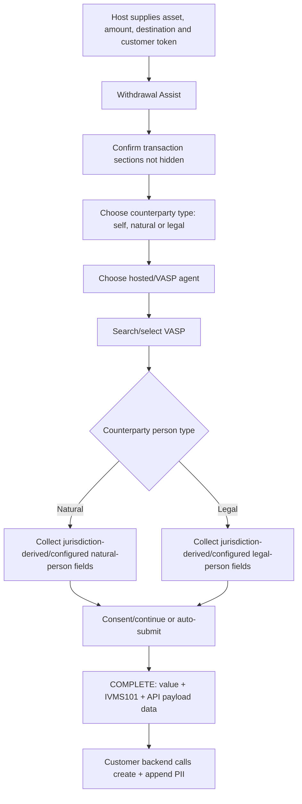
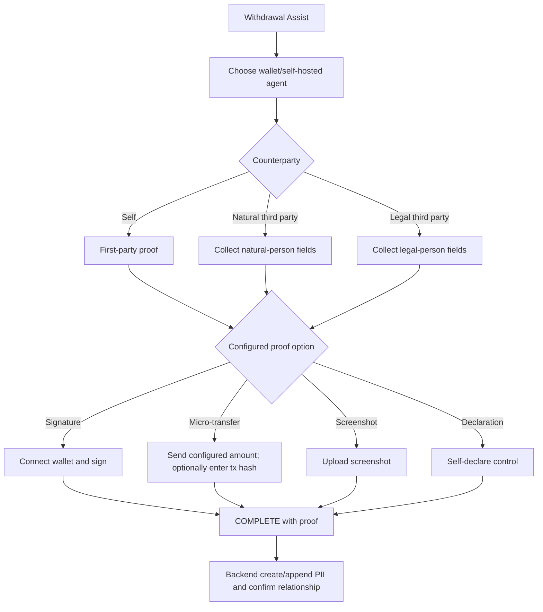
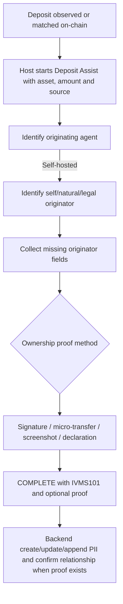
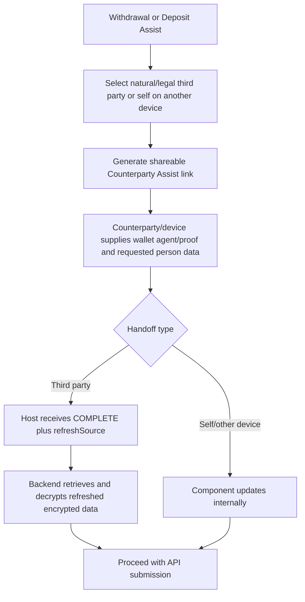
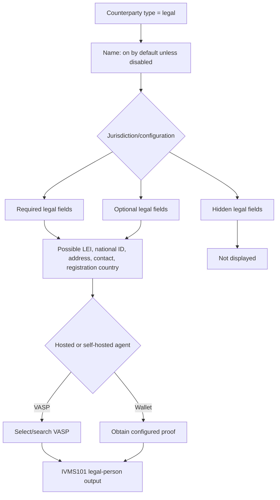

# SafeConnect onboarding and data-collection architecture

## Evidence boundary

**VERIFIED:** The public JavaScript SDK configures and hosts an iframe/modal/popup/link to `connect.notabene.id`; it does not implement the hosted screens. Consequently, the branch logic and configurable sections below are supported by public types/docs, but exact copy, every intermediate screen, and the internal calls made by the hosted app are **UNKNOWN** unless explicitly documented. [SDK-SRC-01, SDK-SRC-02, SDK-SRC-03]

## Integration shell

1. Customer backend obtains a customer-scoped token using a unique `customerRef`; client credentials remain backend-only. **VERIFIED.** [SDK-SRC-01, SDK-SRC-09]
2. Frontend constructs `Notabene({ authToken, ... })`, then creates a component with transaction data and options. **VERIFIED.** [SDK-SRC-01, SDK-SRC-02]
3. Host renders iframe, modal, popup, current-window redirect, or link/mobile redirect. **VERIFIED.** [SDK-SRC-01, SDK-SRC-02]
4. Hosted UX collects data and returns COMPLETE/INVALID/ERROR/WARNING/INFO/RESIZE messages. **VERIFIED.** [SDK-SRC-01, SDK-SRC-06]
5. Host/backend transforms results and calls API endpoints; the wrapper itself does not send funds. **VERIFIED.** [SDK-SRC-05]

## Configurable visibility

- Counterparty fields support `true` = shown/required, `false` = hidden, and `{optional:true}` = shown/optional. Natural and legal-person fields are independently configured. `name` defaults on; legal-person LEI and website are documented as optional defaults. **VERIFIED.** [SDK-SRC-01, SDK-SRC-02]
- If fields are not explicitly configured, the hosted component derives them from the VASP jurisdiction; a configured `jurisdiction` overrides that source. **VERIFIED.** [SDK-SRC-01]
- `hide` can suppress `asset`, `destination`, `counterparty`, `agent`, or `header`; hiding the header does not hide footer attribution. `autoSubmit` can omit Continue and complete once required data is present. **VERIFIED.** [SDK-SRC-01, SDK-SRC-02]
- `allowedAgentTypes` controls wallet/VASP choices; `allowedCounterpartyTypes` controls natural/legal/self branches. `agentSections.main` is always visible and `fallback` sits behind “Can’t find what you’re looking for?”, except fallback is promoted if main is empty/filtered. **VERIFIED.** [SDK-SRC-01]
- **LIMIT:** Public options configure sections/fields, not arbitrary hosted screen composition. No public API proves that customers can hide or reorder every individual question. **UNKNOWN.**

## Proof methods

| Method | Technical flow and result | Evidence-based limitation |
|---|---|---|
| Signature | Connect wallet; hosted UX requests a chain-appropriate signed message; response includes typed proof, CAIP-10 address, DID and signature/metadata. | **VERIFIED:** cryptographic method and proof structures. Exact wallet-specific signing UI is hosted and not in wrapper source. |
| Micro-transfer | Customer config supplies destination, amount subunits and whether tx hash is required; user sends test and returns hash; proof status is pending. | **UNKNOWN:** public proof documentation does not assign on-chain confirmation to either Notabene or the institution. Obtain a written owner and completion contract. |
| Screenshot | User uploads wallet screenshot; completion may have no proof status. | **VERIFIED:** docs explicitly call screenshot insufficient proof/fallback. Authenticity strength is therefore weak **INFERRED**, not a cryptographic claim. |
| Self-declaration | User declares control; completion reports verified in component event docs. | **VERIFIED:** “verified” is component status, not proof of cryptographic control; docs call it insufficient fallback evidence. |
| Reusable proof | `reuseProof` defaults true and requires stable per-customer `customerRef` semantics. | **VERIFIED:** exact server-side matching/expiry policy is **UNKNOWN** publicly. |
| Third-party handoff | Counterparty Assist creates a shareable link for natural/legal or another-device self flow; completion may return `refreshSource`, then host retrieves/decrypts completed data. | **VERIFIED:** it is a feature of Withdrawal/Deposit Assist, not a standalone factory. |

Sources: SDK-SRC-01, SDK-SRC-02, SDK-SRC-04, SDK-SRC-06.

## UX flowcharts

### A. Hosted VASP withdrawal

Selection/collection branches are **VERIFIED**; exact screen count/order is **INFERRED**.

### B. Self-hosted withdrawal

### C. Self-hosted wallet to VASP deposit

Deposit Assist is explicitly post-deposit. Exact hosted question order is **UNKNOWN**.

### D. Third-party/counterparty handoff

### E. Legal-person branch

Possible fields are **VERIFIED as configurable schema**, but which are legally required for a particular transaction is outside this SDK-focused finding.
