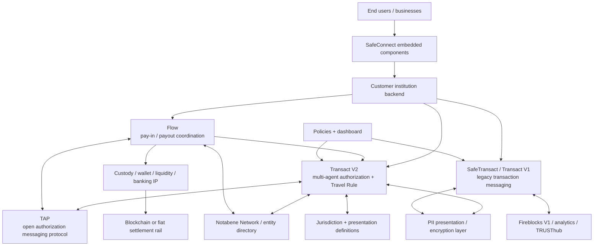

# Notabene product map

Research date: 2026-09-24. Every statement is labeled by evidence status.

## Product relationships

| Module | Status | Technical role | Boundary / relationship | Sources |
|---|---|---|---|---|
| Transact V2 | VERIFIED | Pre-transaction decisioning and Travel Rule exchange using transfers, agents, relationships, policies, PII presentations and settlement reporting. | Represents multi-party authority with `@id`/`for`/`role`; does not itself prove custody. | [flow-S01, flow-S16] |
| SafeTransact / Transact V1 | VERIFIED | Earlier transaction-message API (`txCreate`, V1 statuses, rules) still documented and used by Fireblocks. | Fireblocks page explicitly calls its integration V1. “Legacy” overall is UNKNOWN because V1 remains documented and integrated. | [flow-S01, flow-S07] |
| Flow | VERIFIED | Stablecoin payment request, context, counterparty/compliance coordination, authorization and settlement reporting. | Uses TAP; Flow does not custody, replace KYC/KYB or own customer relationships. It calls shared `/tx` authorize/settle operations. | [flow-S02–flow-S05] |
| TAP | VERIFIED | Open messaging/authorization protocol coordinating identity, compliance, authorization and settlement context. | Protocol does not establish that Notabene moves money; wallet/custody/IP executes value movement. | [flow-S02, flow-S05] |
| SafeConnect | VERIFIED | Front-end JS SDK components for Travel Rule data, wallet classification and ownership proof. | Compatible with V1/V2; component output is transformed into backend V2 `txCreate`, PII and relationship calls. | [flow-S15, flow-S19] |
| Network / directory | VERIFIED / INFERRED | Network/entity discovery and connected counterparties are publicly described; June 2026 rollout exposed Flow responder capability to existing institutions. | INFERRED that Flow reuses the same directory for discovery; internal topology is unpublished. | [flow-S01, flow-S12] |
| Jurisdiction service | VERIFIED | Presentation definitions drive conditional IVMS101 validation. | PIA/PRA supply data; Notabene validates against jurisdiction definitions. | [flow-S03, flow-S17] |
| PII layer | VERIFIED | Managed encryption/storage/re-encryption or customer-managed E2E forwarding. | Notabene can process plaintext in managed mode; docs state E2E payload is not stored in customer-managed mode. | [flow-S17, flow-S18] |
| Policies/dashboard | VERIFIED | UI-configurable authorization and Fireblocks completion/status thresholds; policy webhooks request authorization. | Institution retains decision ownership even when auto-approval is configured. | [flow-S03, flow-S08] |
| Partner integrations | VERIFIED | Fireblocks V1, analytics adapters, sanction-screening adapters and TRUSThub connector are documented. DFNS/Ripple Custody are named only. | Details vary; no generic integration contract is established. | [flow-S07–flow-S10, flow-S14] |

## Inputs, outputs and state

- **VERIFIED — Flow inputs:** institution/customer DIDs, amount/currency, CAIP-19 or PayTo assets, references, customer/merchant context, agents, authorization decisions, IVMS101 presentations, settlement address and settlement ID. Payouts additionally expose structured invoice ID/due date/line items/payment terms and optional CAIP-10 or PayTo settlement address during asset selection. [flow-S03–flow-S05, flow-S24]
- **VERIFIED — outputs/events:** payment link; transfer/flow state; `flow.payin.*`, TAP requirement and `notification.transferStatusChanged` webhooks; authorization URLs; settlement proof/reference. [flow-S03, flow-S04]
- **VERIFIED — persisted state:** customer profiles (PII encrypted in example), transfers, agents, generic transfer status, Flow workflow state, policy evaluations, activity log and settlement IDs are exposed through APIs. Exact databases, retention periods and data residency are UNKNOWN. [flow-S01, flow-S03, flow-S24]
- **INFERRED:** Flow is a specialized orchestration facade over the Transact V2/TAP transfer model, because Flow creation leads to `/tx` authorization/settlement and emits TAP policy events. Internal code/service sharing is UNKNOWN. [flow-S03, flow-S04]
