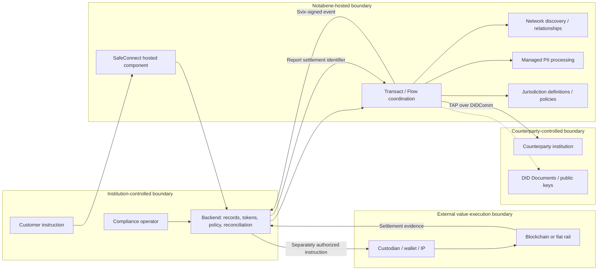

# System map — runtime and trust boundaries

Snapshot: 2026-09-24. This is a **logical runtime map**, not an observed deployment topology. **VERIFIED** labels describe public contracts; **INFERRED** boundaries compose those contracts. Private service decomposition, deployment regions, queues, databases, failover and SLAs remain **UNKNOWN**. Product names are catalogued separately in the Product Map.

Arrows show conceptual message flow, not physical network segments or guaranteed sequencing. A hosted component response is an input to the institution backend, not permission to move funds. TAP is a protocol, not a separate settlement service.

| Runtime surface | Input → output | Control / trust boundary | Public vs proprietary | Evidence |
|---|---|---|---|---|
| Customer client and SafeConnect | Configuration, constrained token, customer input → component result / proof | Institution controls embedding and backend validation; Notabene controls remotely hosted screens | Public wrapper/types; hosted UI implementation not published | [SDK](https://gitlab.com/notabene/open-source/javascript-sdk) |
| Institution backend | Customer instruction, KYC/KYB, component result → authenticated transfer and local custody decision | Institution owns client secret, customer records, policy and reconciliation | Customer-owned implementation | [Authentication](https://devx.notabene.id/reference/authentication-2.md) |
| Transact / Flow | Transfer/customer/agent/policy data → coordination state, callbacks, settlement evidence record | Hosted coordination; not custody signing or movement of value | Published OpenAPI, proprietary operated network | [V2 spec](https://node-open-api-specs.s3.eu-central-1.amazonaws.com/openapi.json) |
| Directory and relationships | Entity/address lookup and proof → discovered counterparties / relationship states | Directory result is not legal identity assurance by itself | Public API; coverage and matching internals UNKNOWN | [V2 spec](https://node-open-api-specs.s3.eu-central-1.amazonaws.com/openapi.json) |
| Jurisdiction / policy | Person type, jurisdiction context and value → published field constraints | Vendor configuration is not law or proof of deployed selection | Public definitions; selector precedence/FX/versioning UNKNOWN | [Index](https://pd.notabene.id/ivms101/v2/jurisdiction-thresholds.json) |
| PII | Plaintext in managed mode or nested ciphertext in E2E mode → stored/re-encrypted or forwarded presentation | Managed mode includes Notabene in plaintext boundary; E2E opacity is conditional, not universal | Public cryptographic SDK; hosted key controls UNKNOWN | [Managed](https://devx.notabene.id/docs/encryption-by-notabene.md), [E2E](https://devx.notabene.id/docs/self-encryption.md) |
| DID / keys and TAP / DIDComm | DID resolution, message/policy → authenticated/encrypted coordination per selected profile | HTTPS/domain, keys and recipient checks are separate trust assumptions | Public standards/source; production profile UNKNOWN | [DID guide](https://devx.notabene.id/docs/diddocs-explained.md), [go-didcomm](https://github.com/Notabene-id/go-didcomm) |
| Webhook delivery | Coordination event → signed HTTP callback | Svix sender to institution receiver; verify signature and replay before use | Public delivery conventions; ordering/window guarantees UNKNOWN | [Webhook flow](https://devx.notabene.id/docs/webhook-flow.md) |
| Analytics providers | Risk/custody context → screening signals | External provider and institution retain assessment duties | V1 has 56 integrations operations; no like-for-like V2 public contract | [V1 spec](https://doc.notabene.id/) |
| Custodian / wallet / IP / rail | Institution-authorized instruction → execution and settlement reference | Keys and money movement outside Notabene coordination | Provider-specific implementation and contract | [Flow](https://devx.notabene.id/docs/introduction.md), [V2 spec](https://node-open-api-specs.s3.eu-central-1.amazonaws.com/openapi.json) |

**VERIFIED live-artifact caveat:** the two captured vasps.id DIDDocs advertise QA DIDComm service hosts. The root `.well-known` document identifies `did:web:vasps.id:at`, not the literal root DID implied by that URL. Neither example establishes a production topology or successful DID resolution validation. [Root](https://vasps.id/.well-known/did.json), [Norway document](https://vasps.id/no/did.json).

**UNKNOWN:** production service boundaries, authorization-to-execution atomicity, finality/reorg handling, failover and complete event ordering. Never collapse “authorized”, “executed” and “settled evidence reported” into one state.