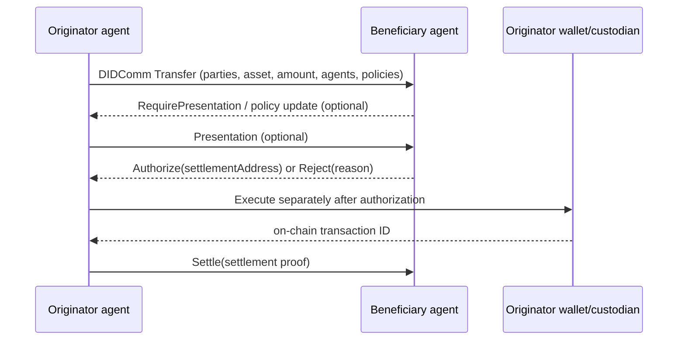

# TAP: open protocol versus Notabene implementation

Evidence date: 2026-09-24. TAP is treated independently from Notabene's commercial SaaS.

## What TAP is—and is not

- **VERIFIED:** TAP is a messaging framework for authorization before blockchain settlement. It separates an off-chain authorization layer from the blockchain settlement layer. It exchanges data, policies and decisions; it does **not itself move money**. [identity-09, identity-12]
- **VERIFIED:** settlement is executed by an originator/wallet outside TAP; `Settle` reports the settlement address/proof/transaction identifier and links the authorized conversation to the chain. [identity-12, identity-13]
- **VERIFIED:** TAP uses DIDComm v2 for authenticated, encrypted, asynchronous agent-to-agent messaging and thread IDs to relate replies. [identity-11, identity-12, identity-13]
- **VERIFIED:** protocol sources claim blockchain/network independence through CAIP identifiers and separation from settlement infrastructure. [identity-09, identity-13]

## Roles and model

- Parties: originator (sends assets), beneficiary (receives), and possible intermediaries.
- Agents: software, institutions, wallets, custodians, risk/compliance or application agents operating for parties/agents.
- Current type source defines agent roles including `SettlementAddress`, `SourceAddress`, `CustodialService`, and `EscrowAgent`; Notabene's product guide uses `VASP`, `Custodian`, `SourceAddress`, `SettlementAddress`. These vocabularies conflict slightly and should not be silently normalized. [identity-08, identity-13]
- TAP agents have DIDs and keys; endpoint resolution prefers DID-document service and may use `serviceUrl` fallback. [identity-11]

## Messages and policies

Core lifecycle messages documented by the protocol are `Transfer`, `Authorize`, `Reject`, `Settle`, `Cancel`, and `Revert`. The repository additionally specifies `Payment`, `RFQ`, `Quote`, `Connect`, `AddAgents`, `ReplaceAgent`, `RemoveAgent`, `UpdateAgent`, `UpdateParty`, policy updates, relationship confirmation, lock/capture and other extensions. [identity-09, identity-10, identity-13]



Policies include authorization, presentation/credential requirements, relationship confirmation, and purpose requirements in the current TypeScript definitions. Published JSON schemas at TAIPs commit `c8dd72c109f1bfdd31a22e19fcc4d11ad5b6654d` expose require-presentation, require-purpose, require-confirmation, and custom policy URIs; the type source and schema vocabulary are not perfectly synchronized. [identity-12, identity-13, identity-20]

## Message example

Illustrative TAP object for Bank A/Alice → Exchange B/Bob:

```json
{
  "id": "tap-example-0001",
  "type": "https://tap.rsvp/schema/1.0#Transfer",
  "from": "did:web:bank-a.example:uk",
  "to": ["did:web:exchange-b.example:sg"],
  "body": {
    "@context": "https://tap.rsvp/schema/1.0",
    "@type": "Transfer",
    "originator": {"@id": "customer:bank-a:alice-1042"},
    "beneficiary": {"@id": "customer:exchange-b:bob-7781"},
    "asset": "eip155:1/slip44:60",
    "amount": "1.0",
    "agents": [
      {"@id": "did:web:bank-a.example:uk", "for": "customer:bank-a:alice-1042"},
      {"@id": "did:web:exchange-b.example:sg", "for": "customer:exchange-b:bob-7781"}
    ]
  }
}
```

Exact required fields must be validated against the versioned schema/types; this example demonstrates shape and delegation only.

## Three separate layers

| Layer | Publicly evidenced responsibility |
|---|---|
| **Open protocol** | message semantics, agent/party model, DIDComm envelope/threading, policies, authorization and settlement-notification schemas |
| **Notabene implementation** | Nodes, Web-DID onboarding, message routing, policy evaluation, presentation exchange, APIs/webhooks, public SDKs |
| **Commercial SaaS** | hosted/regional Nodes, Network/directory, UI, managed encryption, jurisdiction logic, operational webhooks and support; pricing/SLA/internal custody are outside this evidence |

## Parser/source inspection

- **VERIFIED:** the current public protocol organization exposes TAIPs and JSON schemas at commit `c8dd72c109f1bfdd31a22e19fcc4d11ad5b6654d`; relevant files include `tap-overview.md`, `messages.md`, `authorization.md`, `schemas/messages/*.json`, `schemas/data-structures/{agent,policy}.json`.
- **VERIFIED:** `TransactionAuthorizationProtocol/tap-ts`, commit `7b996c4c261ce65e5d0ecf3137638beeb08dc591`, `src/tap.ts`, provides exact TypeScript types for DIDComm messages, parties, agents, policies and message bodies; `src/validator.ts` is the validation surface.
- **UNKNOWN:** no distinct Transaction Authorization Protocol “TAP Parser” repository was found in the unauthenticated Notabene GitLab open-source group listing on 2026-09-24. Search results for npm `tap-parser` refer to the Test Anything Protocol, not Transaction Authorization Protocol. Discovery is not exhaustive; a renamed/private/removed project may exist.

## Sources

identity-08 through identity-13, identity-17, identity-20.