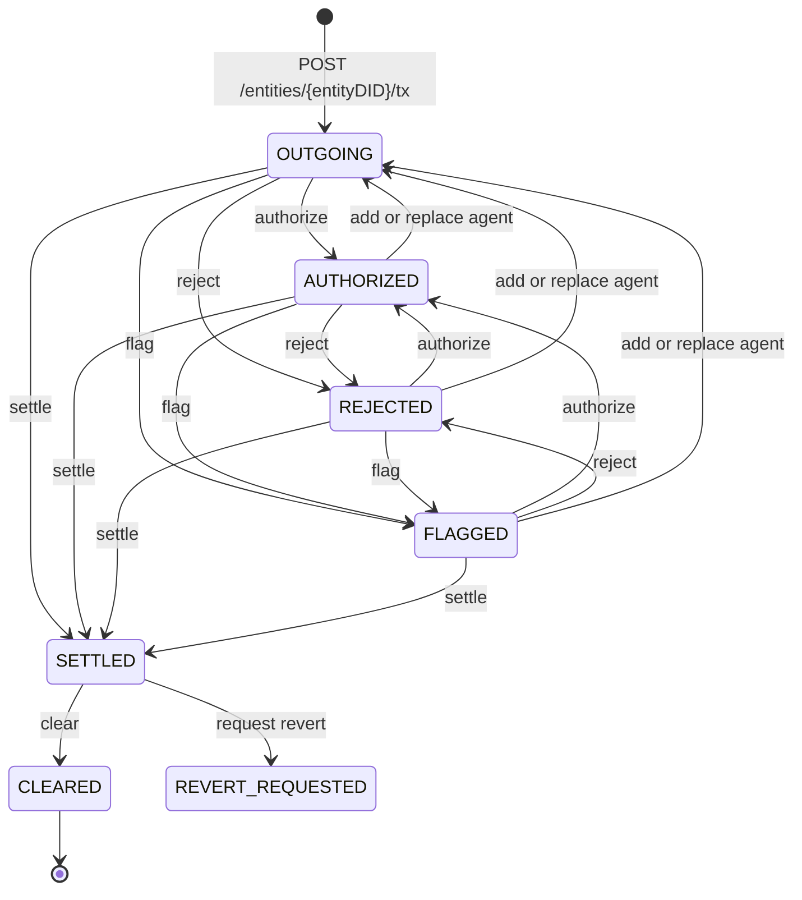
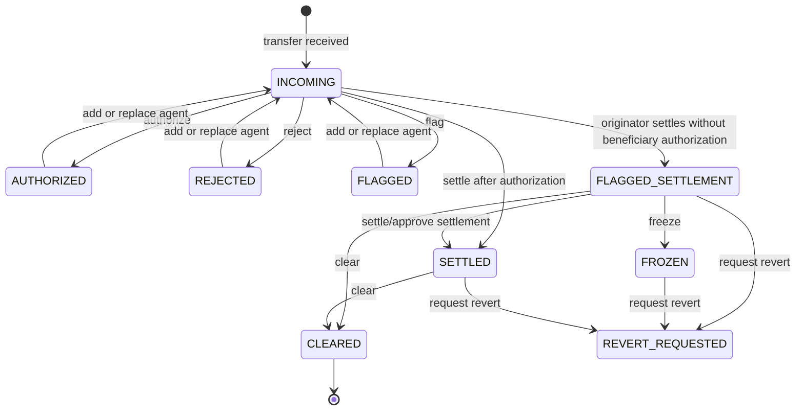
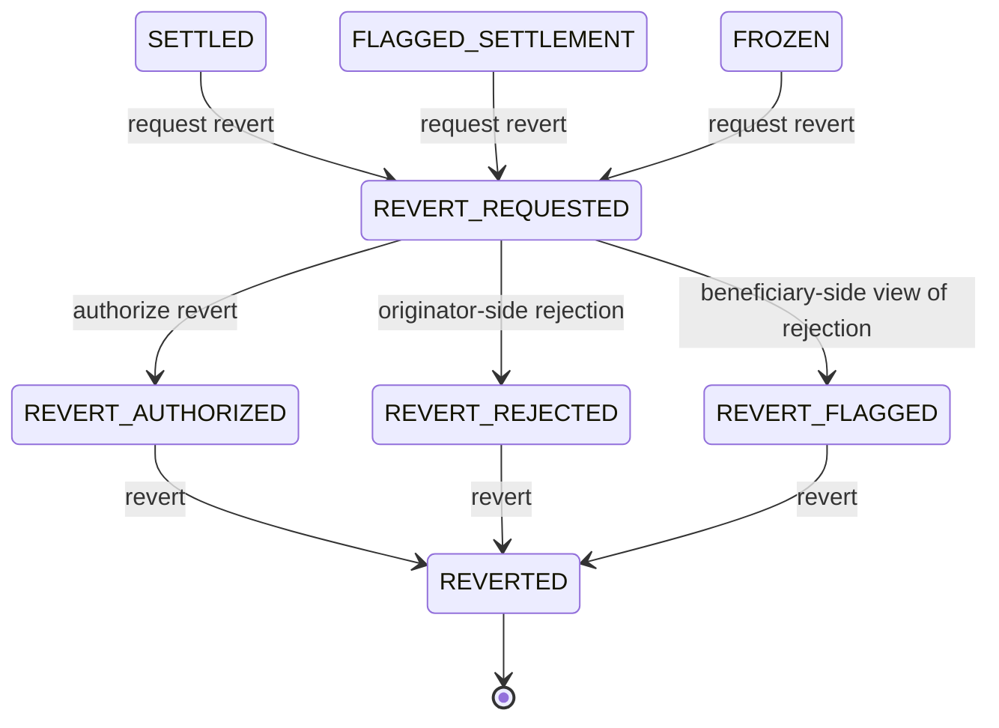

# Transact state machines

**Scope date:** 2026-09-24. Diagrams include only transitions explicitly listed in the public status guide or demonstrated by webhook/API documentation.

## Status families

**VERIFIED**

- Transfer: `OUTGOING`, `INCOMING`, `AWAITING-YOURS`, `AWAITING-COUNTERPARTY`, `REJECTED`, `AUTHORIZED`, `FLAGGED`, `SETTLED`, `FLAGGED-SETTLEMENT`, `REVERTED`, `REVERT-AUTHORIZED`, `REVERT-REJECTED`, `REVERT-FLAGGED`, `FROZEN`, `CLEARED`, `REVERT-REQUESTED`.
- Agent: `PROCESSING`, `AUTHORIZED`, `REJECTED`, `SETTLED`, `FAILED`, `REPLACED`, `UNREACHABLE` in the V2 OpenAPI. The status guide specifically explains `PROCESSING` as corresponding to transfer `INCOMING`/`OUTGOING`, and `FAILED` as an unresolvable web DID.
- Address relationship: `UNCONFIRMED`, `CONFIRMED`, `PROVEN`.
- TAP policy: `PENDING`, `COMPLETED`, `INCOMPLETE`.

The guide spelling “REVERT AUTHORISED” is normalized by the OpenAPI enum to `REVERT-AUTHORIZED`.

## Outgoing view

**VERIFIED** — Create may trigger discovery, policy evaluation, PII and authorization requests, but those are TAP policy events rather than transfer-state values. `notification.transferCreated`, `tap.requirePresentationRequested`, `tap.requireAuthorizationRequested`, and relationship-confirmation events orchestrate these steps.

## Incoming view

**VERIFIED** — `FLAGGED-SETTLEMENT` is beneficiary-side when settlement occurs without explicit beneficiary authorization, or where settlement was explicitly flagged.

## Revert branch

## Webhook-to-state evidence

| Event | Demonstrated transition/purpose |
|---|---|
| `notification.transferCreated` | Transfer exists for both parties |
| `notification.transferStatusChanged` | Local examples: `OUTGOING → AUTHORIZED`, `OUTGOING → REJECTED`, `OUTGOING → SETTLED`, `SETTLED → REVERT-REQUESTED` |
| `notification.transferAgentStatusChanged` | Counterparty agent examples: `PROCESSING → AUTHORIZED`, `AUTHORIZED → REJECTED`, `AUTHORIZED → SETTLED` |
| `tap.requireAuthorizationRequested/Satisfied` | Authorization policy requested/completed; not itself a transfer status |
| `tap.requirePresentationRequested/PartiallySatisfied/Satisfied` | PII policy requested/incomplete/completed |
| `tap.requireRelationshipConfirmationRequested/Satisfied` | Address relationship requested/confirmed |

## V1 state machine contrast

**VERIFIED** — V1's `TransactionStatus` enum is `SAVED`, `MISSING_BENEFICIARY_DATA`, `NEW`, `WAITING_FOR_INFORMATION`, `SENT`, `REJECTED`, `DECLINED`, `ACK`, `CANCELLED`, `INCOMPLETE`, `ACCEPTED`, and `NOT_READY`.

**VERIFIED endpoint effects**

- `txConfirm` sets `ACK`.
- `txReject` sets `REJECTED`.
- `txNotReady` sets `NOT_READY`.
- `txAccept` sets `ACCEPTED`.
- `txDecline` sets `DECLINED`.
- `txCancel` sets `CANCELLED`.

**UNKNOWN** — The reviewed public V1 OpenAPI describes statuses and endpoint effects but does not provide a complete authoritative edge list between every pair. A synthetic full V1 transition graph would therefore overstate the evidence.

## Conflicts and unknowns

- **VERIFIED conflict** — Guides show callback URLs under singular `/entity/.../tx/...`, while current V2 OpenAPI uses plural `/entities/.../tx/...`. Some guide examples also alternate singular/plural relationship paths. The exact OpenAPI paths are recorded in `data/endpoints.json`; callback URLs received from webhooks should not be reconstructed.
- **UNKNOWN** — Transition behavior for V2 `AWAITING-YOURS` and `AWAITING-COUNTERPARTY` is not described in the status table despite their presence in the OpenAPI enum.
- **UNKNOWN** — Atomicity, concurrency control, duplicate-event ordering, delivery ordering, and idempotency behavior beyond the documented `ref` field and Svix retries were not established.
- **VERIFIED** — Svix retries non-2xx deliveries with exponential backoff, signs webhook metadata per endpoint, and supplies `svix-id`, `svix-timestamp`, and `svix-signature` headers.

## v2 audit additions and sources

- **UNKNOWN transitions:** `REPLACED` and `UNREACHABLE` are present in the seven-value Agent status enum, but their transition meanings were not located in the fetched status prose. Their names do not prove terminality. No invented edges are added above.
- **VERIFIED DOCS != OPENAPI:** Agent policy `@type` accepts `REQUIRE_AUTHORIZATION`, `REQUIRE_PRESENTATION`, `REQUIRE_RELATIONSHIP_CONFIRMATION`; its inline example uses `RequireAuthorization`. That example fails its own enum. Deployed acceptance is **UNKNOWN**.
- **VERIFIED vocabulary distinction:** TAP-policy prose `COMPLETED` and beneficiary-name-check enum `COMPLETE` concern different domains; do not normalize them into one enum.
- **VERIFIED documentation only:** the main webhook guide has 12 event types. Six additional `flow.*` names appear in quickstarts; payload schemas and production delivery are **UNKNOWN**. OpenAPI declares no top-level webhook contract.

Sources: [V2 OpenAPI](https://node-open-api-specs.s3.eu-central-1.amazonaws.com/openapi.json), [statuses explained](https://devx.notabene.id/docs/statuses-explained.md), [webhook details](https://devx.notabene.id/docs/webhook-details.md), [PIA quickstart](https://devx.notabene.id/docs/quickstart-pia-create-pay-ins.md), [PRA quickstart](https://devx.notabene.id/docs/quickstart-pra-respond-to-pay-ins.md), [V1 specification](https://doc.notabene.id/).
