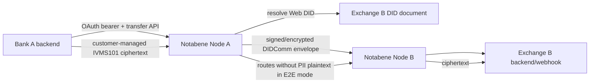

# Identity trust and cryptographic boundaries

Evidence date: 2026-09-24.

## Trust anchors and discovery

1. **VERIFIED:** entity identity starts with a Web DID assigned when the entity is created. `did:web:example.com:x` resolves through HTTPS to `https://example.com/x/did.json`; domain control and HTTPS therefore participate in trust. [identity-01]
2. **VERIFIED:** Notabene generates an initial DID document/Node keys, then the entity downloads it and publishes it on its own domain or redirects to a Notabene-hosted document. The DIDComm service usually points to the Notabene Node on which the entity is onboarded. [identity-01]
3. **VERIFIED:** a sending Node resolves the counterparty DID document, selects the service endpoint and public keys, sends a DIDComm message, and the receiving Node validates the sender DID document/signature. [identity-01]
4. **VERIFIED:** TAP itself also permits a fallback agent `serviceUrl`, but says DID-document endpoints should take priority. [identity-11]
5. **UNKNOWN:** public sources do not fully document directory ranking, duplicate-DID handling, domain verification ceremony, compromise recovery, HSM use, rotation grace periods, or production Node private-key custody.

## DID document key purposes

| Key / DID-document relation | Purpose | Custody boundary | Status |
|---|---|---|---|
| Ed25519 verification method; `authentication` / `assertionMethod` | message/entity signature verification and claims | Node-generated initial private key custody is not publicly specified in operational detail | VERIFIED purpose; UNKNOWN custody |
| X25519 `keyAgreement` | DIDComm secure channel/message encryption | hosted Node can decrypt messages addressed to its key | VERIFIED |
| P-256 `#pii` key (`EcdsaSecp256r1VerificationKey2019`) | dedicated PII encryption key advertised to counterparties/webhooks | customer may replace public key and retain private key for E2E mode | VERIFIED |
| legacy `did:key` Ed25519 PII key | V1/PII SDK encryption; converted to X25519 by SDK code | customer supplies private key to local SDK; directory publishes public DID key | VERIFIED, legacy/current-generation boundary unclear |

The public documentation contains two generations: current Web-DID documents describe X25519 + Ed25519 + P-256 `#pii`, while the PII SDK guide uses legacy `did:key` Ed25519 material and V1 `/tx` endpoints. Treating them as one identical cryptosystem would be incorrect. [identity-01, identity-06, identity-18]

## DIDComm versus PII encryption

- **VERIFIED — hosted encryption:** Node keys allow Notabene to decrypt/process the relevant DIDComm/PII content. [identity-01, identity-18]
- **VERIFIED — customer-managed E2E:** the customer encrypts IVMS101 for the receiver's dedicated public key and posts ciphertext to the presentation API; Notabene applies message-level encryption/signing and routing, but the guide says the PII is not stored on the entity or Notabene platform and Notabene cannot decrypt on the customer's behalf. [identity-02, identity-07]
- **VERIFIED — hybrid/V1:** PII SDK exposes hosted (`0`), E2E (`1`), and hybrid (`2`) modes. If a counterparty lacks a published key, Notabene's escrow key allows UI decryption by parties, so this is not the same trust boundary as customer-only E2E. [identity-06, identity-18]
- **VERIFIED — implementation evidence:** PII SDK commit `2331a4231957549bddd9bb58703ebca274e707d3`, `src/cryptography/index.ts`, constructs authenticated multi-recipient JWE using Ed25519→X25519 conversion and `xc20pAuth...Ecdh1Pu...`; sender, recipient and BCC recipients are included. [identity-19]
- **UNKNOWN:** production at-rest key wrapping, operator access, backup, deletion, tenant isolation, and whether all current V2 PII paths use the exact public SDK algorithm are not established.

## Authority and attack boundaries

- **VERIFIED:** agent `for` relationships represent delegated authority; TAP says each agent is controlled by one party, but cryptographic verification of that relationship is a protocol requirement, not proof that every Notabene payload has independently verifiable delegation credentials. [identity-08, identity-11]
- **VERIFIED:** authorization is an off-chain message decision; settlement proof links it to the blockchain. A DIDComm signature authenticates the key/controller, while compliance policy determines whether that actor is authorized for this transfer. [identity-12]
- **INFERRED:** protecting DNS/domain hosting, Node signing/key-agreement keys, customer PII keys, API client secret, and webhook signing secret are separate operational controls; compromise of one does not automatically imply compromise of all, but can still undermine routing or authorization.

## Worked trust trace

For fictional Bank A/Alice → Exchange B/Bob:

1. Bank A publishes `did:web:bank-a.example:uk`; Exchange B publishes `did:web:exchange-b.example:sg`.
2. Each document advertises signing, key-agreement, optional `#pii`, and DIDComm service data.
3. Bank A's backend creates the transfer; its Node resolves Exchange B and sends an authenticated encrypted DIDComm Transfer.
4. Exchange B requests IVMS101 fields. In customer-managed E2E mode Bank A encrypts Alice/Bob data to Exchange B's PII public key; only Exchange B's retained private key should decrypt it.
5. Exchange B authorizes or rejects. Bank A then instructs its separate wallet/custodian to send funds and emits Settle with transaction proof.

Steps 1–5 are a synthesis of verified mechanisms; the fictional domains, customer identifiers, key custody products, and wallet are illustrative.

## Sources

identity-01, identity-02, identity-06, identity-07, identity-11, identity-12, identity-17, identity-18, identity-19.

## Live identity drift — v2 capture

**VERIFIED DOCS != LIVE ARTIFACT:** the documented PII key type EcdsaSecp256r1VerificationKey2019 / fragment #pii differs from the live JsonWebKey2020 / #notabene-pii with P-256 JWK at vasps.id/no/did.json. Exact fragment equality or exact documentation type matching is not a safe universal selector. Correct production selection, trust validation and rotation rules are **UNKNOWN**, not solved by suffix matching alone.

Both inspected DIDDocs advertise QA service hosts (*.notabene.studio). The root .well-known URL identifies did:web:vasps.id:at rather than the root DID; fetching the JSON does not prove standards-compliant resolution or production interoperability. No DIDComm endpoint was called. The live docs omit the documentation sample's Ed25519 keyAgreement entry.

**UNKNOWN:** legacy did:key Ed25519→X25519 PII versus Web-DID P-256 migration; production DIDComm profiles; HYBRID/escrow key recovery semantics. Public source additions establish capabilities only.

Sources: [documented key convention](https://devx.notabene.id/docs/key-management-in-diddocs.md), [root DIDDoc](https://vasps.id/.well-known/did.json), [Norway DIDDoc](https://vasps.id/no/did.json), [go-didcomm](https://github.com/Notabene-id/go-didcomm).
